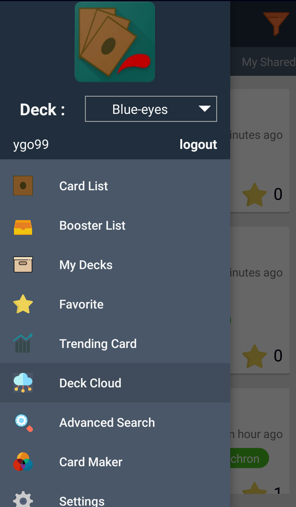
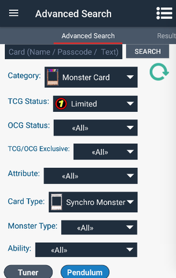
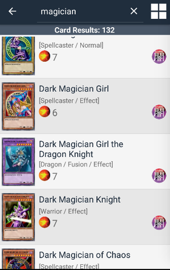
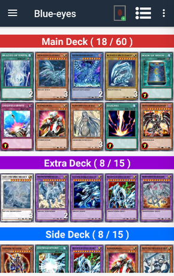
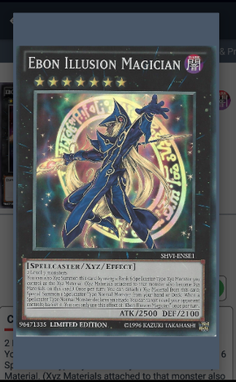
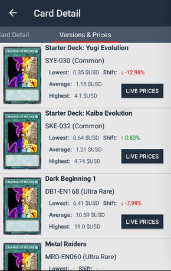

# Yugioh Deck Builder

Android app for Yugioh TCG/OCG Duelists.    
Build your decks with database that constantly updated which contains Yugioh Cards / Yugioh Sets.

Features:
 - Card List with detail of each card.
 - Card Bandlist
 - Card Images on Offline mode ( compressed format )
 - Create and Manage decks.
 - Advanced search ( Card Filtering )
 - Card Versions ( Rarity and Print Tags of cards )
 - Card Sets ( Booster/Packs/Structure Deck )
 - Card Prices with Live Prices from Ebay API
 - Preview real card image
 - Favorite List
 
Download From Play store: [APK](https://play.google.com/store/apps/details?id=com.ygoproject.nawaf.yugiohdeckbuilder) 

<b>License</b>  

All contents were taken from the Yu-Gi-Oh! Wikia. 
All Card's and Set's names,images,text and all other aspects concerning the © Konami and Yu-Gi-Oh! trademark. 
This app is not Affiliated with Yu-Gi-Oh! or © Konami.
